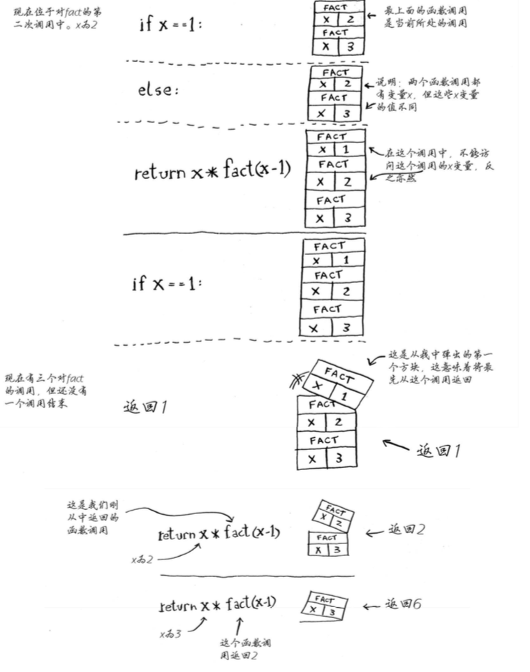
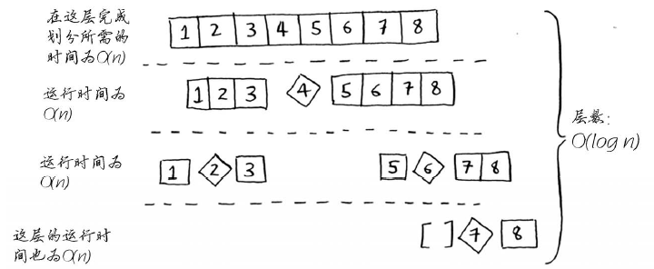

# 第一章：算法简介

## 1.1 引言

## 1.2 二分法

二分法其输入为有序的元素列表。每次都从剩余的元素列表的中间开始找，每次判断都可以排除剩余列表一半的元素。

```python
def binary_search(list, item):
    low = 0
    high = len(list)-1
    
    while low <= high:
        mid = (low+high)/2
        guess = list[mid]
        if guess == item: return mid
        if guess > item:
            high = mid - 1
        else:
            low = mid + 1
    return None
```

大O表示法指出了最糟情况下的运行时间以及算法运行时间的增速。二分法的时间复杂度为$O(log\ n)$，普通查找的时间复杂度为$O(n)$。


旅行商问题：

旅行商要前往n个城市，同时保证旅程最短。

一般算法考虑前往这些城市的所有可能性再找出最短路线，其时间复杂度为$O(n!)$。


# 第二章：选择排序

## 2.1 内存的工作原理

需要将数据存储到内存空间时，计算机提供存储地址。

存储多项数据有两种基本方式：数组和链表。

## 2.2 数组和链表

链表中的元素可以存储在内存任何地方。每个元素都存储了下一个元素的地址，从而使一系列随机的内存地址串在一起。读取链表中的某一元素需要先读取前所有元素，效率低。在链表中插入元素只需修改前面元素指向的地址。删除也只需要修改前一个元素指向的地址。（*表中的时间复杂度前提是能够立即访问到要插入或删除的元素）

一个数组在内存空间中是连续存储的。数组中某一元素可以直接读取。当插入额外元素时，若连续的空间不够则需要专业整个数组的存储地址，所插位置之后的所有元素都要后移。

|      |                    存储方式                    |  读取  |   插入   | 删除     |
| :--: | :--------------------------------------------: | :----: | :------: | -------- |
| 数组 |              在内存空间中连续存储              | $O(1)$ |  $O(n)$  | $O(n)$   |
| 链表 | 在内存空间中任意存储（元素自带下个元素的地址） | $O(n)$ | $O(1)^*$ | $O(1)^*$ |

## 2.3 选择排序

对列表中的数值进行排序，不断遍历列表找到最大值，次大值等等。$O(n^2)$

```python
def findSmallest(arr):
    smallest = arr[0]
    smallest_index = 0
    for i in rang(1, len(arr)):
        if arr[i] < smallest:
            smallest = arr[i]
            smallest_index = i
    return smallest_index

def selectionSort(arr):
    newArr = []
    for i in range(len(arr)):
        smallest = findSmallest(arr)
        newArr.append(arr.pop(smallest))
    return newArr
```


# 第三章：递归

## 3.1递归

递归（函数调用自己）只是让解决方案更清晰，并没有性能上的优势。如果使用循环，程序性能可能更高；如果使用递归，程序可能更容易理解。

## 3.2 基线条件和递归条件

编写递归函数必须告诉它合适停止递归。

每个递归函数都有两部分：基线条件（base case，函数不再调用的条件）和递归条件（recursive case，函数调用自己）

```python
def countDown(i):
    print i
    if i <= 0:			#基线条件
        return
    else:				#递归条件
        countDown(i-1)	
```

## 3.3 栈

堆栈只允许在栈顶进行压入或删除（pop）操作。

### 3.3.1 调用栈

```python
def greet(name):
    print("hello, " + name + "!")
    greet2(name)
    print("getting ready to say bye...")
    bye()
    
def greet2(name):
    print("how are you, "+ name + "?")
    
def bye():
    print("ok bye!")
```

每当调用函数时，计算机将函数调用涉及的所有变了存储到内存中，以一个栈(调用栈)来表示这些内存快。函数调用返回，栈顶顶内存快才会被弹出。<u>（调用另一个函数时，当前函数暂停并处于未完成状态。）</u>

  $\rightarrow$

### 3.3.2 递归调用栈

```python
def factorial(n):
    if n == 1: return 1
    else:
        return n * factorial(n-1)
```




使用栈也有一定代价：可能占用大量内存。可以转而使用循环或者尾递归。


# 第四章：快速排序

##4.1 分而治之（Divide and conquer）

欧几里得算法：又称辗转相除法，gcd(a,b)=gcd(b, a mod b)。基于定理：两个整数的最大公约数等于其中较小的那个数和两数相除余数的最大公约数（Greatest Common Divisor）。

Code_1：

```python
def Euclidean(a,b):

    if a <= b: 
        remainder = b % a
        b = remainder
    else: 
        remainder = a % b
        a = remainder

    if remainder > 0: return Euclidean(a,b)
    else: return print("The greatest common divisor is {}.".format(max(a,b)))
```

Code_2：

```python
def gcd(a,b):
    while a != 0:
        a, b = b % a, a
    return b
```

利用递归和分治法编写一个数组所有元素的和：

```python
def sum_recursion(a):
    if a == []: return 0				#基线条件
    else:
        return a.pop(0)+sum_recursion(a)	#递归条件
```

## 4.2 快速排序

对数组进行快速排序：

* 基线条件：数组为空或只包含一个元素
* 原理：从数组中选择一个元素作为基准值（pivot）；接下来找出比基准值小的元素和比基准值大的元素（分区，partitioning）；再对分区的两个子数组进行快速排序。

```python
def quicksort(array):
    if len(array) < 2:
        return array
    else:
        pivot = array[0]
        less = [i for i in array[1:] if i <= pivot]
        greater = [i for i in array[1:] if i > pivot]
        return quicksort(less) + [pivot] + quicksort(greater)
```


## 4.3 再谈大O表示法

快速排序最糟情况$O(n^2)$，平均运行时间为$O(nlog\ n)$。

合并排序（merge sort）的运行时间为$O(nlog\ n)$。[合并排序图解][https://www.cnblogs.com/chengxiao/p/6194356.html]
$$
c * n\ \ \ \rightarrow\ \ \ \ c表示算法所需的固定时间量
$$
通常如果两个算法的时间复杂度不同，常量将无关紧要。但对于快速查找和合并查找来说，常量影响可能很大。快速查找的常量比合并查找小，若它们运行时间都为$O(nlog\ n)$，快速查找的速度更快。

快速排序的性能高度依赖于所选的基准值：

* 最差情况，基准值为最小或最大值。栈长$O(n)$。
* 最佳情况，基准值为中间值。栈长$O(log\ n)$。




# 第五章：散列表

