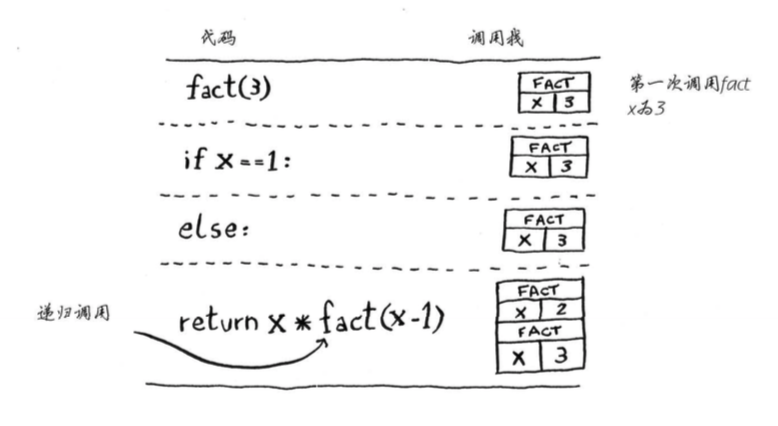

# 第一章：算法简介

## 1.1 引言

## 1.2 二分法

二分法其输入为有序的元素列表。每次都从剩余的元素列表的中间开始找，每次判断都可以排除剩余列表一半的元素。

```python
def binary_search(list, item):
    low = 0
    high = len(list)-1
    
    while low <= high:
        mid = (low+high)/2
        guess = list[mid]
        if guess == item: return mid
        if guess > item:
            high = mid - 1
        else:
            low = mid + 1
    return None
```

大O表示法指出了最糟情况下的运行时间以及算法运行时间的增速。二分法的时间复杂度为$O(log\ n)$，普通查找的时间复杂度为$O(n)$。


旅行商问题：

旅行商要前往n个城市，同时保证旅程最短。

一般算法考虑前往这些城市的所有可能性再找出最短路线，其时间复杂度为$O(n!)$。


# 第二章：选择排序

## 2.1 内存的工作原理

需要将数据存储到内存空间时，计算机提供存储地址。

存储多项数据有两种基本方式：数组和链表。

## 2.2 数组和链表

链表中的元素可以存储在内存任何地方。每个元素都存储了下一个元素的地址，从而使一系列随机的内存地址串在一起。读取链表中的某一元素需要先读取前所有元素，效率低。在链表中插入元素只需修改前面元素指向的地址。删除也只需要修改前一个元素指向的地址。（*表中的时间复杂度前提是能够立即访问到要插入或删除的元素）

一个数组在内存空间中是连续存储的。数组中某一元素可以直接读取。当插入额外元素时，若连续的空间不够则需要专业整个数组的存储地址，所插位置之后的所有元素都要后移。

|      |                    存储方式                    |  读取  |   插入   | 删除     |
| :--: | :--------------------------------------------: | :----: | :------: | -------- |
| 数组 |              在内存空间中连续存储              |  $O(1)$  |  $O(n)$  | $O(n)$   |
| 链表 | 在内存空间中任意存储（元素自带下个元素的地址） |  $O(n)$  |  $O(1)^*$  | $O(1)^*$ |

## 2.3 选择排序

对列表中的数值进行排序，不断遍历列表找到最大值，次大值等等。$O(n^2)$

```python
def findSmallest(arr):
    smallest = arr[0]
    smallest_index = 0
    for i in rang(1, len(arr)):
        if arr[i] < smallest:
            smallest = arr[i]
            smallest_index = i
    return smallest_index

def selectionSort(arr):
    newArr = []
    for i in range(len(arr)):
        smallest = findSmallest(arr)
        newArr.append(arr.pop(smallest))
    return newArr
```


# 第三章：递归

## 3.1递归

递归（函数调用自己）只是让解决方案更清晰，并没有性能上的优势。如果使用循环，程序性能可能更高；如果使用递归，程序可能更容易理解。

## 3.2 基线条件和递归条件

编写递归函数必须告诉它合适停止递归。

每个递归函数都有两部分：基线条件（base case，函数不再调用的条件）和递归条件（recursive case，函数调用自己）

```python
def countDown(i):
    print i
    if i <= 0:			#基线条件
        return
    else:				#递归条件
        countDown(i-1)	
```

## 3.3 栈

堆栈只允许在栈顶进行压入或删除（pop）操作。

### 3.3.1 调用栈

```python
def greet(name):
    print("hello, " + name + "!")
    greet2(name)
    print("getting ready to say bye...")
    bye()
    
def greet2(name):
    print("how are you, "+ name + "?")
    
def bye():
    print("ok bye!")
```

每当调用函数时，计算机将函数调用涉及的所有变了存储到内存中，以一个栈(调用栈)来表示这些内存快。函数调用返回，栈顶顶内存快才会被弹出。<u>（调用另一个函数时，当前函数暂停并处于未完成状态。）</u>

  $\rightarrow$

### 3.3.2 递归调用栈

```python
def factorial(n):
    if n == 1: return 1
    else:
        return n * factorial(n-1)
```




使用栈也有一定代价：可能占用大量内存。可以转而使用循环或者尾递归。


# 第四章：快速排序

## 4.1 分而治之（Divide and conquer）

欧几里得算法：又称辗转相除法，gcd(a,b)=gcd(b, a mod b)。基于定理：两个整数的最大公约数等于其中较小的那个数和两数相除余数的最大公约数（Greatest Common Divisor）。

Code_1：

```python
def Euclidean(a,b):

    if a <= b: 
        remainder = b % a
        b = remainder
    else: 
        remainder = a % b
        a = remainder

    if remainder > 0: return Euclidean(a,b)
    else: return print("The greatest common divisor is {}.".format(max(a,b)))
```

Code_2：

```python
def gcd(a,b):
    while a != 0:
        a, b = b % a, a
    return b
```

利用递归和分治法编写一个数组所有元素的和：

```python
def sum_recursion(a):
    if a == []: return 0				#基线条件
    else:
        return a.pop(0)+sum_recursion(a)	#递归条件
```

## 4.2 快速排序

对数组进行快速排序：

* 基线条件：数组为空或只包含一个元素
* 原理：从数组中选择一个元素作为基准值（pivot）；接下来找出比基准值小的元素和比基准值大的元素（分区，partitioning）；再对分区的两个子数组进行快速排序。

```python
def quicksort(array):
    if len(array) < 2:
        return array
    else:
        pivot = array[0]
        less = [i for i in array[1:] if i <= pivot]
        greater = [i for i in array[1:] if i > pivot]
        return quicksort(less) + [pivot] + quicksort(greater)
```


## 4.3 再谈大O表示法

快速排序最糟情况$O(n^2)$，平均运行时间为$O(nlog\ n)$。

合并排序（merge sort）的运行时间为$O(nlog\ n)$。[合并排序图解](https://www.cnblogs.com/chengxiao/p/6194356.html)
$$
c * n\ \ \ \rightarrow\ \ \ \ c表示算法所需的固定时间量
$$
通常如果两个算法的时间复杂度不同，常量将无关紧要。但对于快速查找和合并查找来说，常量影响可能很大。快速查找的常量比合并查找小，若它们运行时间都为$O(nlog\ n)$，快速查找的速度更快。

快速排序的性能高度依赖于所选的基准值：

* 最差情况，基准值为最小或最大值。栈长$O(n)$。
* 最佳情况，基准值为中间值。栈长$O(log\ n)$。


# 第五章：散列表(Hash Table)

## 5.1 散列函数

散列函数：将输入映射到数字。（理想情况：将不同的输入映射到不同数字。）

* 散列函数总是将同样的输入映射到相同的索引。

* 散列函数将不同的输入映射到不同索引。

* 散列函数知道数组有多大，只返回有效索引。

散列函数 + 数组 = 散列表， 散列表示一种包含额外逻辑的数据结构。数组和链表都被直接映射到内存，但散列表使用散列函数来确定元素的存储位置。

在Python中，散列表的实现为字典dict()。


## 5.2 应用案例

### 5.2.1 将散列表用于查找

创建电话簿，将姓名映射到电话号码。

```python
phone_book = dict() #等效 phone_book = {}
phone_book["jenny"] = 8675309
phone_book["emergency"] = 911

print(phone_book["jenny"]) #查找key为jenny的value
```

访问网站时，网址都必须转换为IP地址。将网址映射到IP地址的过程称为DNS解析(DNS resolution)。


### 5.2.2 防止重复

场景：投票管理。

创建一个散列表记录已投票的人。

```python
voted = {}
def check_voter(name):
	if voted.get(name):
		print "kick them out!"
	else:
		voted[name] = True
		print "let them vote!"
```


### 5.2.3 将散列表用作缓存

网站将需要重复显示的页面存储起来（缓存），在需要时直接发给用户。（如主页，About页面，Contact页面等）

* 用户能更快地看到网页
* 网站需要做的工作更少


```python
cache = {}

def get_page(url):
    if cache.get(url):
        return cache[url]  #返回缓存数据
    else:
        data = get_data_from_server(url)   #先将数据保存在缓存中
        cache[url] = data
        return data
```


## 5.3 冲突

散列表冲突(collision)：给两个键分配的位置相同。

简单的解决办法：如果两个键映射到了同一位置，就在这个位置存储一个链表。

经验教训：

* 散列函数很重要。最理想的情况是散列函数将键均匀地映射到散列表的不同位置。
* 如果散列表存储的链表很长，散列表的速度会急剧下降。


## 5.4 性能

散列表的性能：

|      | 平均情况 | 最糟情况 |
| :--: | :------: | :------: |
| 查找 |  $O(1)$  |  $O(n)$  |
| 插入 |  $O(1)$  |  $O(n)$  |
| 删除 |  $O(1)$  |  $O(n)$  |

$O(1)$为常量时间，表示不管散列表多大，所需的时间都相同。

使用散列表时，需要避免其最糟情况（避免冲突）：

* 较低的填装因子
* 良好的散列函数


### 5.4.1 填装因子

$$
填装因子=\frac  {散列表包含的元素数}{位置总数}
$$

填装因子度量的是散列表中有多少位置是空的。填装因子大于1意味着元素数量超过了数组的位置数。一旦装填因子开始增大就需要在散列表中添加位置（调整长度，resizing）。

填装因子越低，发生冲突的可能性越小，散列表的性能越高。一个不错的经验规则：一旦填装因子大于0.7，就调整散列表的长度。

### 5.4.2 良好的散列函数

良好的散列函数让数组中的值呈均匀分布。

SHA函数：安全散列算法（Secure Hash Algorithm）,能计算出一个数字消息所对应到长度固定的字符串（消息摘要）


# 第六章：广度优先搜索

## 6.1 简介

解决最短路径问题，可以采取广度优先搜索算法(Breath-first search, BFS)。

* 使用图来建立问题模型
* 广度优先搜索解决问题

## 6.2 图是什么

图由节点和边组成，表示节点所示元素和元素之间的关系。

图分为有向图和无向图。

## 6.3 广度优先搜索

广度优先搜索是用于图的查找方法，可解决两类问题：寻找路径和寻找最短路径。

### 6.3.1 查找最短路径

广度优先搜索执行过程中，搜索范围从起点开始逐渐向外延伸。（一度关系 $\rightarrow$ 二度关系 $\rightarrow$ $\dots$）

按添加顺序查找，先添加一度关系，再添加二度关系。

### 6.3.2 队列

实现按添加顺序查找的数据结构：队列(queue)

队列只支持两种操作：入队和出队。先加入的元素将在后加入元素之前出队（先进先出，First In First Out, FIFO）。相对的，栈是一种后进先出（Last In First Out, LIFO）的数据结构。


## 6.4 实现图

节点和邻近节点的对应关系用散列表存储。散列表能将键映射到值。


```python
graph = {}
graph["you"] = ["alice", "bob", "claire"]
graph["bob"] = ["anuj", "peggy"]
graph["alice"] = ["peggy"]
graph["claire"] = ["thom", "jonny"]
graph["anuj"] = []
graph["peggy"] = []
graph["thom"] = []
graph["jonny"] = []
```

## 6.5 实现算法

1. 创建一个队列，用于存储要检查的人。

2. 从队列中弹出一个人。

3. 检查这个人是否“满足需要”。

4. a. 是，return

   b. 否，将这个人的所有邻居加入队列

5. 重复第2步直到队列里没有人或者中途return。

值得注意的是，如果一个人同时是两个人的朋友，就会添加此人两次，为了避免重复判断（可能造成死循环），需要加入判断，检查过的人不再检查。

```python
from collections import deque

def person_is_seller(name)
    search_queue = deque()		#创建一个队列
    search_queue += graph[name]		#将你的邻居加入到队列中
    searched = []
    while search_queue:		#只要队列不空
        person = search_queue.popleft()		#就取出其中第一个人
        if not person in searched:			#仅当这个人没检查过时才检查
            if person_is_seller(person):		#检查其是否为芒果销售商
                print person + " is a mango seller!"
                return ture
            else:
                search_queue += graph[person]	#不是芒果销售商，将这个人的朋友加入搜索队列
                searched.append(person)			#这个人标记为检查过
    return False		#如果到了这里，就说明队列中没人是芒果销售商
```

时间复杂度：沿着每条边搜索为$O(E)$，额外一个队列添加检查过的人，$O(V)$（顶点Vertice数）。总运行时间为$O(V+E)$。


# 第七章：狄克斯特拉算法

加权图，提高或降低某些边的权重。

使用Dijkstra’s algorithm 寻找加权图的最短路径。


## 7.1 使用狄克斯特拉算法

步骤：

1. 找出“最便宜”的节点，即可在最短时间内到达的节点。
2. 更新前往该节点的邻居的开销。检查是否有前往它们的更短路径。
3. 重复这个1,2过程，直到对图中没个节点都这样做了。
4. 计算最终路径。

非加权图：广度优先搜索。加权图：狄克斯特拉算法


## 7.2 术语

狄克斯特拉算法用于每条边都有关联数字的图，这些数字称为权重（weight）。

图中还可能出现环，意味着从一个节点出发，走一圈之后又回到这个节点。无向图中两个节点之间的连接可以看作环。狄克斯特拉算法只适用于有向无环图（directed acyclic graph, DAG）。


## 7.3 换钢琴

起点：乐谱。终点：钢琴。


狄克斯特拉算法背后的关键理念：找出图中最便宜的节点，并确保没有到该节点的更便宜路径。


## 7.4 负权边

如果有负权边，就不能使用狄克斯特拉算法。

因为狄克斯特拉算法这样假设：对于处理过的海报节点，没有前往该节点的更短路径。

在包含负权边的有向无环图中，要找出最短路径，可以使用另一种算法——贝尔曼-福德算法（Bellman-Ford algorithm）。

Bellman-Ford算法步骤：

1. 初始化所有点。原点为0，其他店设为无穷大。
2. 进行循环，遍历所有的边，进行松弛计算（松弛一条边$(u,v)$的过程中，测试是否可以通过u对已找到的到v的最短路径进行改进）。
3. 遍历途中所有边，判断是否存在权为负的回路。

狄克斯特拉算法以贪心法选取未被处理的最小权值的节点，然后对其的出边进行松弛操作；而贝尔曼-福德算法则简单地对所有边进行松弛操作，共有$V-1$次，V为图中节点的数量。贝尔曼-福德算法的计算复杂度为$O(V\cdot E)$。


## 7.5 实现

